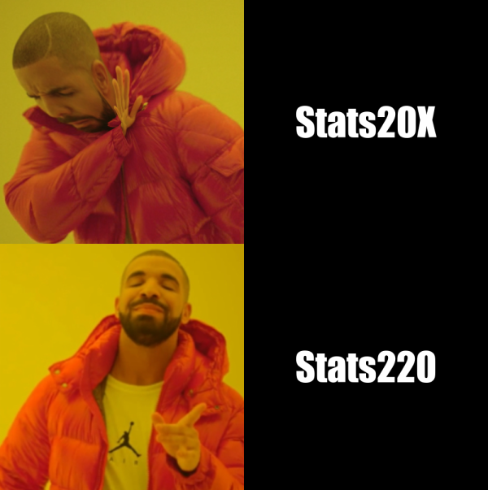

## Drake _meme_ Inspiration
The meme I created follows the existing drake hotline bling meme format, but with a stats220 spin on it. I was inspired to make this meme when thinking of ways to show my love and dedication to this course, as this is the best course with the best lecturers, markers and tutors, who teach the most interesting and useful content.

## Themes and Messages
The beauty of the meme is that it is so simple, yet sends a strong message. The most popular stage 2 stats course, STATS20X, is amazing at teaching theory and learning about distributions. However it is **STATS220** which explores the practical side of statistics, teaching the most important software to any statistician. The facial features showing Drake's confused state while turning his head away, transitioning into a _"that hits the spot"_ expression, perfectly encapsulates the emotions of a second stage statistics student. It is only when the student takes STATS220, that a student fully express themselves (through memes and gifs) using all the amazing tools that R/magick can provide.

```r

library(magick)

# implode image makes it look funnier
# decrease saturation to emphasize drake_mmm
drake_eww <- image_read("https://static.hiphopdx.com/2015/10/drake-hotline-bling-jacket-moncler.png") %>%
  image_scale(500) %>%
  image_implode() %>%
  image_modulate(saturation=80)

drake_mmm <- image_read("https://i.imgflip.com/4wpsm3.jpg") %>%
  image_scale(500)

# add text to meme
eww_text <- image_blank(width = 500, 
                          height = 500, 
                          color = "#000000") %>%
  image_annotate(text = "Stats20X",
                 color = "#FFFFFF",
                 size = 80,
                 font = "Impact",
                 gravity = "center")

mmm_text <- image_blank(width = 500, 
                         height = 505, 
                         color = "#000000") %>%
  image_annotate(text = "Stats220",
                 color = "#FFFFFF",
                 size = 80,
                 font = "Impact",
                 gravity = "center")

# concatenate image and text
first_row <- c(drake_eww, eww_text) %>%
  image_append()

second_row <- c(drake_mmm, mmm_text) %>%
  image_append()

# complete meme, resize
meme <- c(first_row, second_row) %>%
  image_append(stack = TRUE) %>%
  image_scale(600)

meme

# save meme
image_write(meme, "my_meme.png")
```
